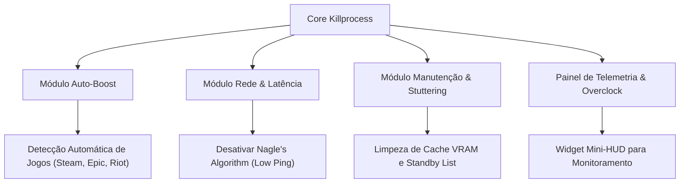

# 🧠 Relatório Estratégico de Consultoria & Análise de Software
**Projeto:** Killprocess / Game Booster (Razer Edition)
**Data:** Maio de 2026  
**Perfil:** Consultoria de Arquitetura de Software e Inteligência de Mercado

---

## 1. Visão Geral e Análise de Mercado

O **Killprocess** consolidou-se como um utilitário de altíssimo nível, destacando-se pela interface "Razer Edition" e pelo controle granular de processos em tempo real. No entanto, para competir com os principais players do mercado (*Razer Cortex, CCleaner, Wise Game Booster*), o software precisa evoluir de um utilitário manual para uma **suíte de otimização proativa**.

### Matriz SWOT do Software Atual

| Forças (Strengths) | Fraquezas (Weaknesses) |
| :--- | :--- |
| • Interface moderna (Estética Gamer Razer) • Controle cirúrgico de processos críticos e seguros • 7 Níveis de Otimização robustos e eficientes | • Dependência de ações manuais do usuário • Falta de automação ao iniciar jogos • Ausência de otimizações de rede (Ping/Latência) |
| **Oportunidades (Opportunities)** | **Ameaças (Threats)** |
| • Expansão para módulo "Auto-Boost" • Inclusão de Limpeza de Cache de Disco e VRAM • Monitoramento de Telemetria e Hardware | • Players consolidados com ecossistemas integrados • Restrições do Windows Defender sobre certas alterações de registro |

---

## 2. Proposta de Evoluções e Novas Funcionalidades

Para dominar o mercado de otimizadores gamer, propomos a expansão da arquitetura do Killprocess em **4 novos pilares estratégicos**:

---

### 🚀 Pilar 1: Módulo "Auto-Boost" (Proatividade)
Atualmente, o usuário precisa abrir o Killprocess e aplicar o otimizador manualmente antes de jogar.
- **Como funcionaria:** O Killprocess escaneia os jogos instalados (Steam, Epic Games, Riot Client) e fica minimizado na bandeja do sistema (*System Tray*).
- **Ação:** Ao detectar que `valorant.exe` ou `cs2.exe` foi iniciado, o Killprocess aplica o nível de otimização configurado automaticamente. Quando o jogo fecha, ele restaura os serviços do Windows.

### 🌐 Pilar 2: Otimização de Rede e Latência (Ping Gamer)
Reduzir a latência (Ping) e evitar perda de pacotes é tão vital para os gamers quanto aumentar o FPS.
- **Registro do Windows (TCP NoDelay):** Ativar a desativação do algoritmo de Nagle para enviar pacotes de rede imediatamente.
- **DNS Otimizado:** Oferecer botões para configurar DNS de alta performance (ex: Cloudflare 1.1.1.1 ou Google 8.8.8.8) com 1 clique.
- **Limpeza de Rede:** Adicionar o comando `ipconfig /flushdns` integrado à interface.

### 🧹 Pilar 3: Eliminação de Micro-Stutters (Limpeza de Cache)
Muitos travamentos (*stutters*) em jogos competitivos são causados pelo uso excessivo de memória standby ou cache de disco.
- **Limpeza de Arquivos Temporários:** Remover arquivos em `%TEMP%`, `Prefetch` e cache de shaders antigos.
- **Empty Standby List:** Criar um botão para forçar o Windows a liberar a memória em espera (cache de RAM), retornando memória livre instantaneamente para o jogo.

### 🖥️ Pilar 4: Widget de Telemetria Gamer (Mini-HUD)
Permitir que o usuário acompanhe o desempenho sem ocupar a tela inteira.
- **Mini-HUD:** Um modo compacto ou overlay flutuante na tela mostrando:
  - Uso de CPU (%)
  - Uso de RAM (%)
  - FPS aproximado ou Temperatura da GPU

---

## 3. Próximos Passos Sugeridos (Fase 3 & 4)

Com base nesta análise, recomendamos o seguinte roadmap de desenvolvimento:

1. **Sprint 1 (Automação):** Criar aba de "Jogos Detectados" e integração com a bandeja do sistema (*System Tray*).
2. **Sprint 2 (Rede e Cache):** Adicionar recursos de latência zero (TCP NoDelay) e botão de "Limpeza Profunda de Cache".
3. **Sprint 3 (Compactação):** Lançar a versão empacotada em `.exe` com manifesto de administrador para distribuição pública.
