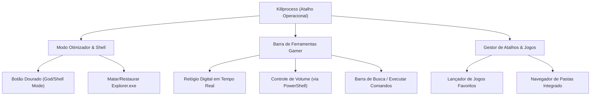

# 🗺️ Plano Estratégico: Transformação em Atalho Operacional

Este documento propõe a reestruturação e expansão do **Killprocess** de um simples otimizador para um **Atalho Operacional Gamer** (Mini Shell). O objetivo é permitir que o usuário desative completamente o `explorer.exe` (liberando RAM e CPU) e utilize o Killprocess como sua central de comando para jogar.

---

## 🏛️ Nova Estrutura de Funcionalidades



---

## 🛠️ Detalhamento Técnico da Implementação

### 1. 🟡 O Botão Dourado (Modo Shell Ativo)
- **Função:** Ativa o Modo Deus + Fecha o `explorer.exe` para economizar memória RAM e remover processos em segundo plano da interface do Windows.
- **Lógica:**
  - Quando **Ligado**: Executa o encerramento do `explorer.exe` e aplica todas as otimizações do Modo Deus.
  - Quando **Desligado**: Inicia o `explorer.exe` e restaura os padrões do sistema.
- **Design:** Botão destacado com gradiente dourado (`#FFD700` a `#B8860B`) na barra superior ou na sidebar.

### 2. 🕰️ Barra de Ferramentas Gamer (Substituta da Barra de Tarefas)
Como a barra de tarefas do Windows some ao fechar o Explorer, o Killprocess fornecerá recursos essenciais:
- **Relógio e Data:** Exibidos com tipografia digital futurista (`Orbitron` ou `Segoe UI`) no topo do aplicativo.
- **Controle de Volume:**
  - Slider interativo de volume ou botões de aumentar (`+`) / diminuir (`-`) volume.
  - Implementado via PowerShell sem necessidade de dependências extras:
    ```powershell
    (New-Object -ComObject WScript.Shell).SendKeys([char]175) # Aumentar Volume
    (New-Object -ComObject WScript.Shell).SendKeys([char]174) # Diminuir Volume
    ```
- **Barra de Pesquisa / Comando de Execução:**
  - Caixa de entrada para digitar um caminho de pasta (ex: `C:\`) ou comandos e executá-los diretamente no sistema.

### 3. 🎮 Central de Atalhos e Launcher de Jogos
- **Biblioteca de Jogos Favoritos:**
  - Grade visual de botões para os jogos mais jogados do usuário (CS2, Valorant, GTA V, etc.).
  - Ao clicar em um jogo, o Killprocess o inicia instantaneamente.
- **Navegador de Pastas:**
  - Atalho rápido para abrir diretórios do Windows mesmo sem o Explorer (usando chamadas internas ou listagem simplificada).

---

## 📅 Próximos Passos de Desenvolvimento

1. **Revisar a UI/UX** de `gui.py` para abrir espaço para o novo painel do shell no topo ou como uma nova aba principal.
2. **Adicionar o botão dourado** no topo da barra de navegação ou sidebar.
3. **Integrar os novos componentes** de ferramentas gamers (Volume, Relógio, Pesquisa de Comandos).
4. **Efetuar testes locais** para validar que o fechamento do Explorer funciona em conjunto com o Killprocess atuando como shell.
